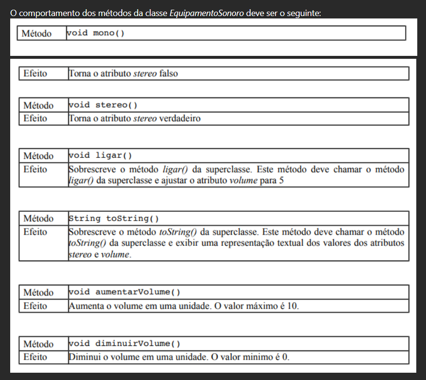

Implemente as classes mostradas no diagrama de classes UML abaixo:

O comportamento dos métodos da classe Equipamento é o seguinte:

O comportamento dos métodos da classe EquipamentoSonoro deve ser o seguinte:

Escreva uma classe para testar a classe EquipamentoSonoro

