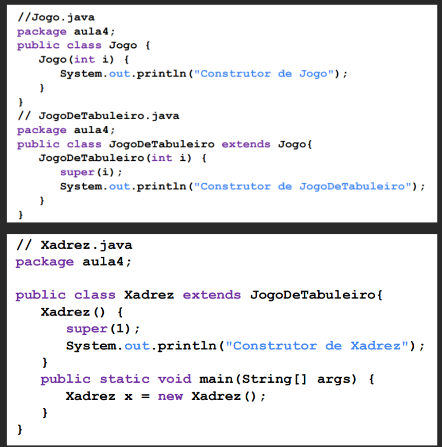
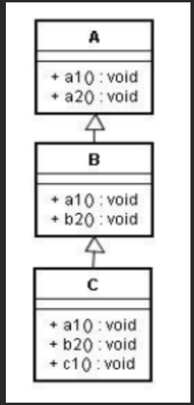

https://fatecspgov.sharepoint.com/sites/Section_ILP007.A485.N.048.129.20232/Shared%20Documents/General/ExeOOP.pdf?CT=1693865646740&OR=ItemsView

Comente o construtor da classe Xadrez e explique o que acontece.

Comente a chamada explícita a super no construtor da classe JogoDeTabuleiro e explique o que acontece.
Considere o Diagrama de Classes UML abaixo:

Implemente uma aplicação em Java aonde cada classe deve possuir um construtor default e outro com argumento
Os construtores das classes derivadas devem chamar os construtores das classes base e os métodos sobrepostos devem ser chamados pelos métodos que os sobrepõem
Cada método deve exibir apenas uma mensagem identificando-o